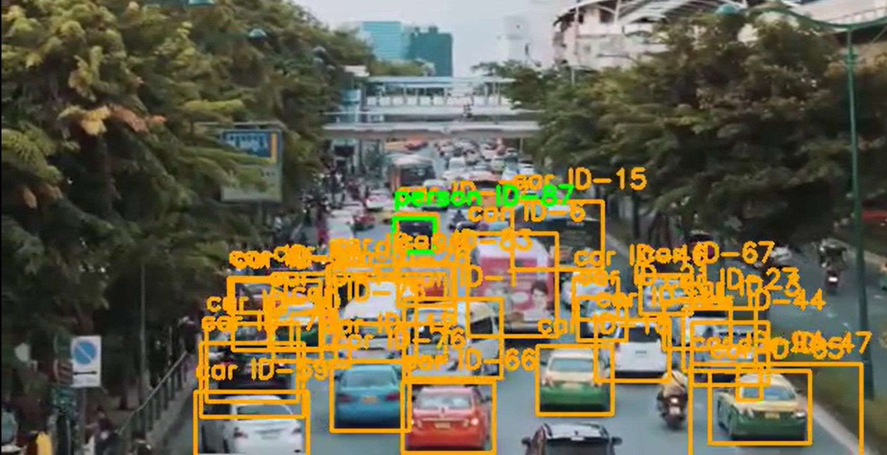

# Object-Detection-Tracking

This project implements a real-time object detection and tracking system using YOLOv8 and DeepSORT. It can detect and track multiple objects such as cars and people in video streams.


# Features
- Object detection using YOLOv8
- Multi-object tracking with DeepSORT
- Unique ID assignment for each object
- Video processing and output generation
- Model evaluation dashboard
- 
# Technologies Used
- Python
- YOLOv8 (Ultralytics)
- OpenCV
- DeepSORT
- Google Colab
  
# How to Run
- Open the notebook in Google Colab
- Install dependencies using requirements.txt
- Upload a video
- Click "Process Video"
  
# Output
- Bounding boxes on objects
- Object tracking with IDs
- Processed output video

## screenshot

[](https://github.com/Deepika20027/Object-Detection-Tracking/raw/main/dowload.mp4)

## Project Structure

```
Object-Detection-Tracking/
│
├── src/
│   └── main.py             
│
├── demo/
│   ├── demo_video.mp4       
│   └── thumbnail.png
│
├── requirements.txt       
├── README.md

```

